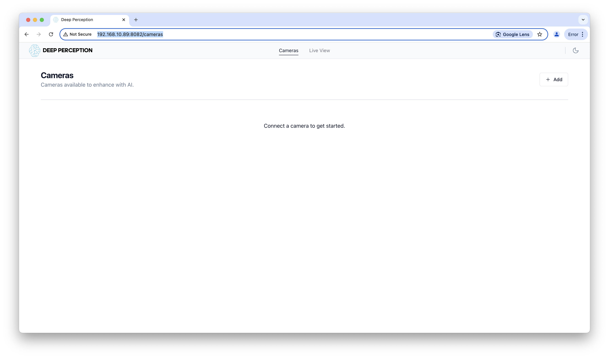
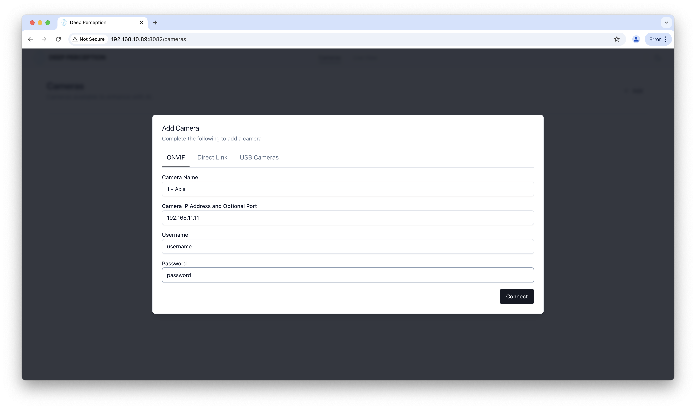
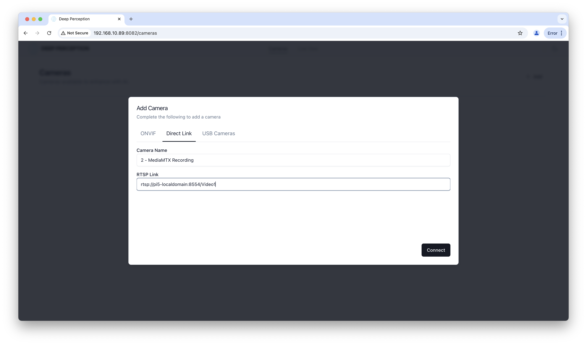
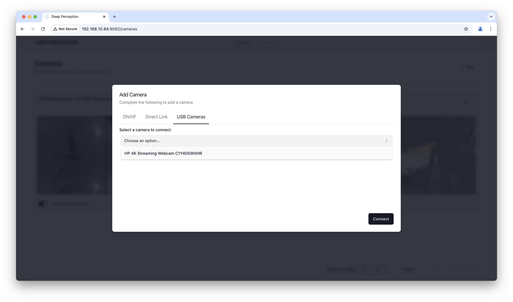
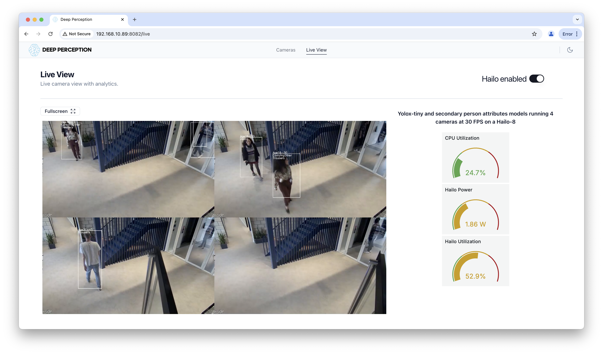
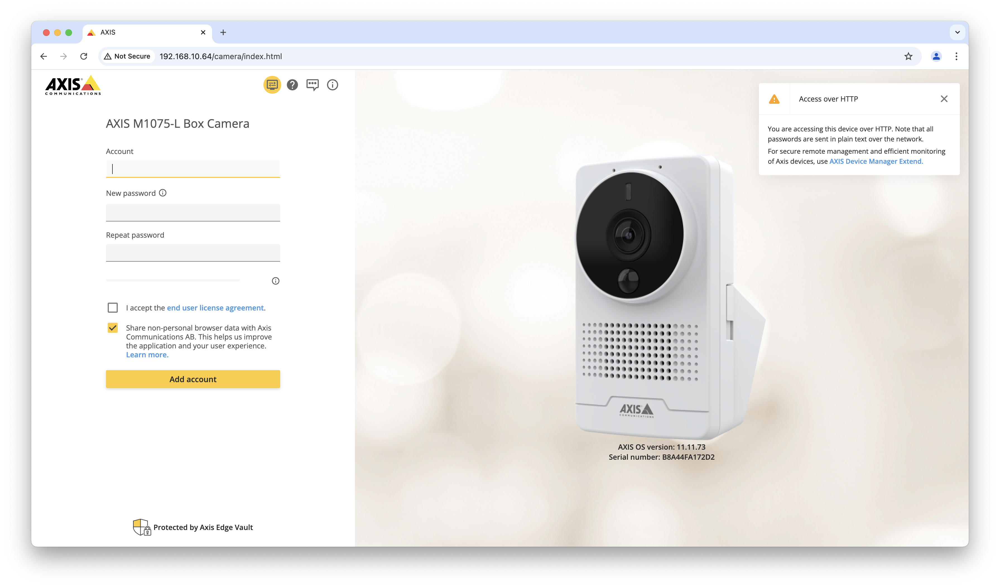
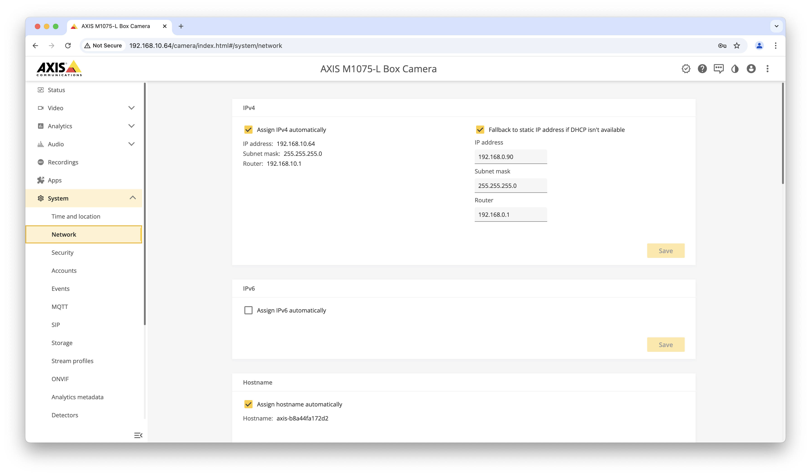
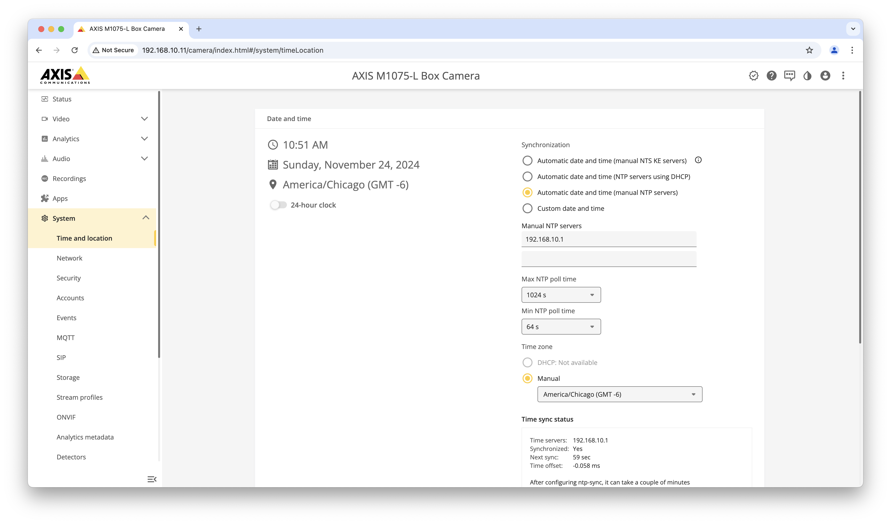
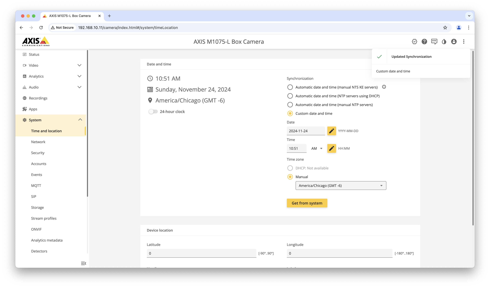
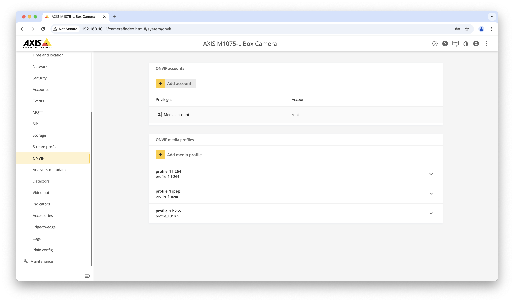

# Setup for Challenger Demo

## System Requirements:

1. Ubuntu 24.04 LTS Desktop
2. Intel i5 or better CPU to run CPU inference portion of the Demo
3. One Hailo-8 AI accelerator (no kernel module installed, our scripts will install the correct version)
4. 4 video sources consisting of any combination of ONVIF cameras, direct RTSP links and directly attached USB cameras. 1920x1080 30FPS sources preferred.
5. System that supports VA-API h264 encode and decode (Most Intel and AMD integrated and discrete graphics cards supported)  

## Initial Setup on clean Ubuntu 24.04 LTS Desktop Installation

1. Clone this repo on to the demo machine
2. Run initial-setup/install_prereqs.sh and reboot when  prompted
3. Copy separately provided service_account.json into **initial-setup** folder
4. Run initial-setup/add_gcr.sh which uses the service_account.json file to enable docker to pull from a private registry
5. Optional: Run initial-setup/find_axis.sh to find Axis cameras on the same subnet as the demo system. Axis camera setup instructions are further down in this document. 

## Running the Demo

1. Run start.sh to start the demo software, containers will pull from private registry first time the script is run
2. Run stop.sh to stop the demo software
3. Open Chrome and navigate to http://localhost:8082 (F11 can be used to put Chrome into full screen kiosk mode)

## Maintenance Operations

1. maint-scripts/pull_latest.sh will stop the demo and pull the latest container images. Use start.sh to restart the demo
2. maint-scripts/remove_containers.sh will delete the containers 
3. maint-scripts/remove_containers_volumes.sh will remove the container images and the persistent volumes resetting the demo software
4. "docker system prune --all" can be used to further clean up the system if desired 

# Demo Configuration

The WebUI can be accessed on port 8082 via localhost on the same machine or by IP address from any system that has network connectivity.

## Add Cameras

The camera name that is first alphabetically and numerically will be used for the CPU live view and to build the 2x2 grid for Hailo mode. It is recommended to use "Number -" naming to control which camera is used. 

Adding up to 4 cameras is supported. Cameras can be deleted, renamed and disabled from the camera setup screen.

## Add ONVIF Camera

Enter the camera name, IP address and ONVIF credential to add an ONVIF compliant camera. 

## Add RTSP Source

Any RTSP source can be directly added as a camera. Enter the full URL including any necessary credentials and port information.

## Add USB Camera 

Select an available directly attached USB camera from the drop down list.

## Live View

Live view will show up to 4 cameras running at the same time running both the object detection and classifier model. Switching to CPU mode will only show the first camera in the live view disply only running the object detection model. Use the toggle switch to switch between CPU and Hailo mode, it may take several secondds for the switch to occur. 

# Axis camera configuration

The Axis camera will DHCP an address by default. If a DHCP server is not available the camera will set itself to 192.168.0.90. You can use the script initial-setup/find_axis.sh to help find the address of any Axis camera on the same subnet. One you know the camera IP address, connect to it with a web browser.

Create the default account on the camera. These credentials will be used to further configure the camera.

## Configure camera network settings

Connect to the camera, log in and navigate to the network settings page. Configure for static IP address is desired.

## Configure camera time settings

Navigate to the time settings page and configure a NTP server if available. Otherwise, use custom time and synchronize the camera's time with the browser.

## Add ONVIF account

Navigate to the ONVIF  page and create an ONVIF account that has media profile access. These credentials will be used in the demo app to connect to the camera.

# Scripts for offline container loading

maint-scripts/download_images.sh will pull the images and create tar files in docker_images folder. The entire challenger-setup directory can then packaged up and deployed on an offline system. Use "tar -cf challenger-setup.tar challenger-setup/" to create the tar file.

To load the images, run maint-scripts/load_images.sh on the target system.
